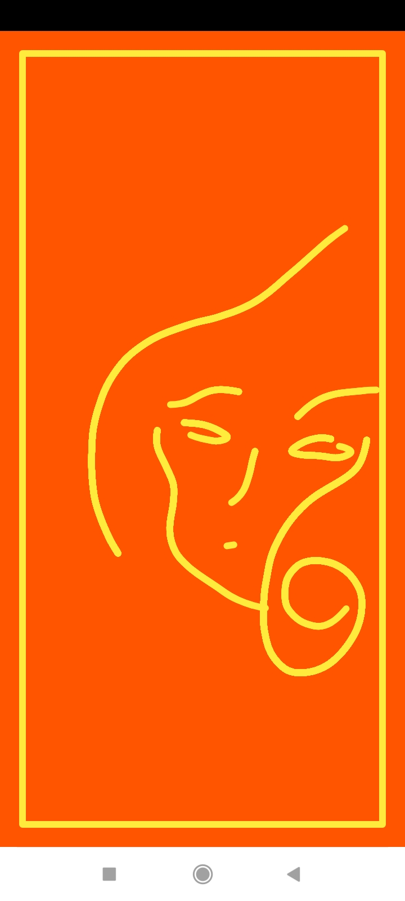

# MiniPaint
An app to demo drawing on canvas by touch events.

The steps include:
1. Creating a custom view and setting it to contentView instead of the XML layout.
2. Inside the view, overriding onSizeChanged so as to create the bitmap and the canvas with the new dimensions.
    
    Creating new Bitmaps every other time this function is invoked leads to memory leak because old bitmaps are left around, to handle this, recycle is used.
    ```Kotlin
        if (::extraBitmap.isInitialized) extraBitmap.recycle()
    ```
3. Overriding onDraw and drawing the bitmap on the canvas, with its coordinates initialized to 0,0 - units in pixels, which referes to the top left corner of the screen.
4. A Path object is initialized to store the path being drawn when following the user's touch.
5. Overriding onTouchEvent and acting on the various events
      ```Kotlin         
        override fun onTouchEvent(event: MotionEvent): Boolean {
          motionTouchEventX = event.x
          motionTouchEventY = event.y
   
          when (event.action) {
            MotionEvent.ACTION_DOWN -> touchStart()
            MotionEvent.ACTION_MOVE -> touchMove()
            MotionEvent.ACTION_UP -> touchUp()
            }
         return true
      }
   ```
   To capture the drawing correctly, the variables need to be re-assigned on every event, such that the previous touch event is updated with the new event coordinates.
6. To filter out unnecessary events, touch tolerance can be used to determine minimum acceptable event by using 
   ```Kotlin
     private val touchTolerance = ViewConfiguration.get(context).scaledTouchSlop
   ```
   The touchMove() function depends on this  
   ```Kotlin
      private fun touchMove() {
      val dx = abs(motionTouchEventX - currentX)
      val dy = abs(motionTouchEventY - currentY)
      if (dx >= touchTolerance || dy >= touchTolerance) {
       // QuadTo() adds a quadratic bezier from the last point,
       // approaching control point (x1,y1), and ending at (x2,y2).
       path.quadTo(currentX, currentY, (motionTouchEventX + currentX) / 2, (motionTouchEventY + currentY) / 2)
       currentX = motionTouchEventX
       currentY = motionTouchEventY
       // Draw the path in the extra bitmap to cache it.
       extraCanvas.drawPath(path, paint)
     }
     invalidate()
   }
   ```
   Only draw if the movement was equal to or more that the accepted tolerance.
7. The drawing can optionally be cached in bitmap, path or other mechanism.

## Screenshots

&nbsp;&nbsp;&nbsp;&nbsp;
